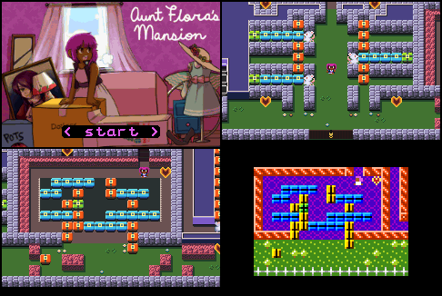

Aunt Flora's Mansion for Game Boy Advance
=========================================

Port of [_Aunt Flora's Mansion_](https://w.itch.io/aunt-floras-mansion) to Game Boy Advance.

_Aunt Flora's Mansion_ is a cute [PuzzleScript](https://www.puzzlescript.net/) game made by
[anna anthropy](https://w.itch.io/).  We thought it would be fun to port it to the GBA (with
permission), so more people are exposed to the game, and as a hackable project for others.

Features:

1. Puzzle, graphics, and sound effects from original game
2. Undo and checkpoint saving
3. New HD graphics and expanded viewport
4. Music track (Hungarian Dance no. 5)
5. Permissible license to encourage hacking

My best score for total steps is 1213.

[Download the GBA ROM here](https://github.com/velipso/auntflora/releases/download/v0.8/auntflora.gba).
You will need an emulator to play the game, we suggest [mGBA](https://mgba.io).



Build Instructions
------------------

This project used [gba-bootstrap](https://github.com/AntonioND/gba-bootstrap) as a starting point.

You will need to install the ARM GCC via:

```bash
# Mac OSX
brew install gcc-arm-embedded

# Linux
sudo apt install gcc-arm-none-eabi

# Windows
# Download from:
#   https://developer.arm.com/downloads/-/arm-gnu-toolchain-downloads
```

Then, run `make`:

```bash
make
```

And the ROM will be output to `tgt/auntflora.gba`.
